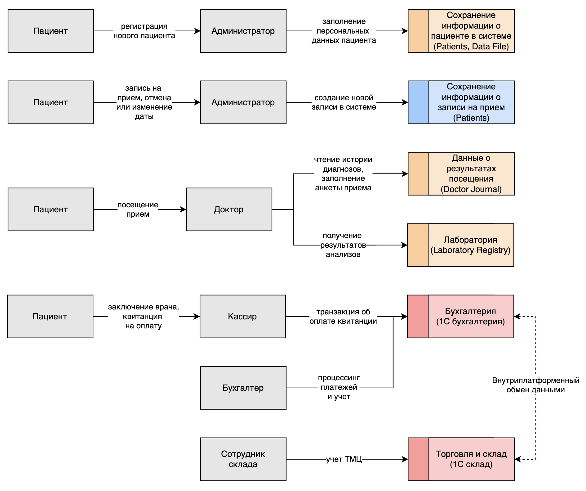

## Задание 1. Анализ безопасности системы

Чтобы заниматься реализацией новых продуктов, которые основаны на данных, необходимо системно решить проблему хранения 
конфиденциальных данных и управления ими. Сейчас данные лежат в непосредственной близости к пользователям, поэтому 
существует риск утечки данных и неправомерного использования информации.

Чтобы защитить данные, используйте механизмы, инструменты и принципы работы с конфиденциальными данными, например, 
подходы Privacy By Design, Data Minimization и Data Lineage.

В рамках этого задания вам нужно проанализировать состояние As-Is, чтобы впоследствии приступить к его доработке.

### Что нужно сделать

1. Выявите конфиденциальные данные, которые не учтены во внутренних системах.  
 - Проанализируйте информацию о компании.
 - Создайте диаграммы потоков данных (Data Flow Diagrams). Для каждого процесса создайте отдельную диаграмму.
 - Отобразите на них, как данные перемещаются по системам компании и какие операции над ними совершают.
2. Проведите аудит мер по обеспечению безопасности данных.
 - Сопоставьте процессы в компании с требованиями по обеспечению безопасности данных и архитектурными практиками в области безопасности конфиденциальных данных.
 - Составьте список проблемных зон и сохраните его в отдельный документ.
3. Подумайте, что можно улучшить.  
 - Составьте список данных для защиты и проставьте для каждого способы защиты — шифрование, обфускация, обезличивание.
 - Разработайте механизм тегирования данных с использованием инструментов тегирования.
 - Составьте список инструментов, способов и мер, которые позволят обеспечить конфиденциальность данных в указанных потоках.
 - Доработайте диаграммы из предыдущего шага: отобразите на них, что следует использовать на каждом этапе потока.

При работе над диаграммами потоков данных ориентируйтесь на рекомендации, которые мы дали в уроке «Как управлять потоками данных», и гайд от Lucidchard.

Когда задание будет готово, загрузите диаграммы потоков данных и список проблем в директорию Task1 в рамках пул-реквеста.

### Выполнение задание

1. В ходе исследования структуры и диаграммы C4 компании были выполнены следующие шаги: 

Построена [Data Flow Diagram](data-classification.drawio) для внутренних процессов компании (1 страница документа): 

На данной диаграмме цветами отмечены данные относительно классификации: публичные, внутренние, конфиденцтальные, секретные.

2. Проведен аудит мер по обеспечению безопасности данных.

| Процесс компании                                                | Проблема безопасности                                                                                                                 | Способ устранения                                                                                                                                                                                                                                       |
|-----------------------------------------------------------------|---------------------------------------------------------------------------------------------------------------------------------------|---------------------------------------------------------------------------------------------------------------------------------------------------------------------------------------------------------------------------------------------------------|
| Хранение, чтение и обработка информации о пациентах             | Локальное хранение данных в файлах Excel на локальном ПК.                                                                             | Использование централизованного хранилища файлов, которое позволит разграничить доступ к файлам, а также предоставить функциональность к шифрованию этих файлов.                                                                                        |
| Чтение и изменения журнала приема пациентов                     | Локальное хранение данных в файлах Excel на локальном ПК.                                                                             | Использования централизованной БД, которая позволит разграничить доступ, упростит обновление данных о записях, исключая коллизию при записи.                                                                                                            |
| Чтение истории посещений и запись результата посещения пациента | В системе не указано, скорее подразумевается физический носитель в виде "книга болезни".                                              | Использование централизованной БД и хранилища файлов, которые позволят исключить потерю данных при потере физического носителя. Также это упростит пациентам процесс посещения врача. А врачам поиск необходимой информации в истории болезни пациента. |
| Бухгалтерия и склад                                             | В файловом режиме работы 1С все данные хранятся в одном файле. Одновременный доступ блокируется, следовательно низкая продуктивность. | Перевод режима работы с файлового режима на веб-клиент в 1С.                                                                                                                                                                                            |
| Отсутствие аудита системы                                       | Отсутствие понимания потенциальных мест угроз в безопасности, а также понимая способов их утсранения или минимизации.                 | Проведение мероприятия по аудиту безопасности. Устранение или минимизация потенциальных угроз.                                                                                                                                                          |

Далее был составлен минимальный проверочный листю

Проверочный лист включает разделы:
- *Управление доступом* - Существует проблема передачи полномочий после изменений в командах. Особенно важен контроль привилегий и удаление неактуальных учётных записей.
- *Безопасность данных* - Нарушен контроль над данными клиентов и собственников. Требуется политика классификации данных, шифрование, резервирование и управление доступом к данным.
- *Защита инфраструктуры* - Много гибридных и облачных решений, есть риски с доступностью и защищённостью сети, особенно через партнёрские API. Нужны firewalls, IDS/IPS, сегментация сети.
- *Управление инцидентами* - Нет системной работы с инцидентами, что критично в свете роста числа угроз.
- *Специфические аспекты* - Работа с мобильными приложениями для клиентов и собственников + необходимость контроля удалённого доступа и управления устройствами.

| №                                                            | Вопрос                                                                                                                                       | Да/нет     | Комментарий |
|--------------------------------------------------------------|----------------------------------------------------------------------------------------------------------------------------------------------|------------|-------------|
| **I. Управление доступом**                                   | -------------------------------------------------------------------------------------------------------------------------------------------- | ---------- | ----------- |
| 1                                                            | Настроены ли требования к сложности паролей и их регулярное обновление?                                                                      |            | Нет данных  |
| 2                                                            | Проводится ли аудит и пересмотр учётных записей с повышенными привилегиями на регулярной основе?                                             |            | Нет данных  |
| 3                                                            | Автоматически ли удаляются или деактивируются учётные записи после увольнения или изменения должности сотрудников?                           |            | Нет данных  |
| 4                                                            | Ведётся ли журналирование всех операций доступа к системам и данным? Кто имеет доступ к журналам?                                            | Нет        |             |
| 5                                                            | Ведётся ли единый реестр учётных записей?                                                                                                    | Да         |             |
| 6                                                            | Используются ли средства управления учётными записями на базе единого реестра?                                                               | Да         |             |
| 7                                                            | Применяются ли средства для отзыва прав доступа?                                                                                             |            | Нет данных  |
| 8                                                            | Используются ли средства централизованного контроля доступа?                                                                                 | Нет        |             |
| **II. Безопасность данных**                                  | -------------------------------------------------------------------------------------------------------------------------------------------- | ---------- | ----------- |
| 1                                                            | Разработана ли политика классификации данных, и актуализируется ли она в соответствии с действующим законодательством?                       | Нет        |             |
| 2                                                            | Используется ли шифрование на уровне базы данных, файловой системы и при передаче данных по сети?                                            |            | Нет данных  |
| 3                                                            | Реализованы ли механизмы управления ключами шифрования?                                                                                      |            | Нет данных  |
| 4                                                            | Проводится ли регулярное резервное копирование данных? Хранятся ли резервные копии в защищённых хранилищах?                                  |            | Частично    |
| 5                                                            | Выполняется ли регулярное тестирование процесса восстановления данных из резервных копий?                                                    |            | Нет данных  |
| 6                                                            | Ограничен ли доступ к резервным копиям данных, и зашифрованы ли они?                                                                         |            | Нет данных  |
| 7                                                            | Ведётся ли учёт персональных данных, и применяются ли специальные процедуры обработки и хранения для различных типов данных?                 |            | Нет данных  |
| 8                                                            | Осуществляется ли мониторинг доступа к данным на основе их классификации? Используются ли метки безопасности для маркировки данных?          |            | Нет данных  |
| 9                                                            | Разработаны ли процессы и системы Data Governance для управления данными?                                                                    |            | Нет данных  |
| 10                                                           | Реализованы ли системы или процессы безопасного уничтожения данных?                                                                          |            | Нет данных  |
| 11                                                           | Используются ли системы или процессы контроля целостности данных?                                                                            |            | Нет данных  |
| 12                                                           | Реализованы ли системы или процессы контроля сохранности данных?                                                                             |            | Нет данных  |
| 13                                                           | Применяются ли средства или процессы анонимизации данных?                                                                                    |            | Нет данных  |
| 14                                                           | Разработана ли инструкция по процессу восстановления данных?                                                                                 |            | Нет данных  |
| **III. Защита инфраструктуры**                               | -------------------------------------------------------------------------------------------------------------------------------------------- | ---------- | ----------- |
| 1                                                            | Используется ли межсетевой экран для ограничения входящего и исходящего трафика?                                                             |            | Нет данных  |
| 2                                                            | Реализована ли сегментация сети на логические зоны (DMZ, корпоративная сеть, гостевая сеть) для ограничения доступа к критическим ресурсам?  |            | Нет данных  |
| 3                                                            | Используются ли IDS/IPS-системы для обнаружения и предотвращения сетевых атак?                                                               |            | Нет данных  |
| 4                                                            | Настроен ли мониторинг сетевого трафика на предмет аномалий и возможных атак, например, DDoS?                                                |            | Нет данных  |
| 5                                                            | Проводится ли регулярное сканирование уязвимостей операционных систем, приложений и сетевых устройств?                                       |            | Нет данных  |
| 6                                                            | Установлены ли на серверах и рабочих станциях антивирусные программы и системы EDR?                                                          |            | Нет данных  |
| 7                                                            | Отключены ли неиспользуемые службы и порты на серверах, рабочих станциях и сетевом оборудовании?                                             |            | Нет данных  |
| 8                                                            | Используются ли механизмы контроля целостности системных файлов? Ведётся ли журналирование доступа к системным ресурсам?                     |            | Нет данных  |
| 9                                                            | Проводятся ли автоматизированные сканирования облачных инфраструктур на соответствие рекомендациям безопасности?                             |            | Нет данных  |
| 10                                                           | Реализовано ли автоматическое обновление сигнатур защиты от вредоносных программ?                                                            |            | Нет данных  |
| 11                                                           | Осуществляется ли фильтрация трафика между сетевыми сегментами?                                                                              |            | Нет данных  |
| 12                                                           | Используются ли средства для контроля периметра доступа?                                                                                     |            | Нет данных  |
| **IV. Управление инцидентами**                               | -------------------------------------------------------------------------------------------------------------------------------------------  | ---------- | ----------- |
| 1                                                            | Используется ли система мониторинга безопасности (SIEM) для корреляции событий и анализа аномалий в режиме реального времени?                |            | Нет данных  |
| 2                                                            | Настроены ли автоматические оповещения об инцидентах и подозрительной активности (например, попытках несанкционированного доступа)?          |            | Нет данных  |
| 3                                                            | Разработан ли план реагирования на инциденты, включающий анализ, эскалацию и восстановление системы? Проводится ли обучение сотрудников?     |            | Нет данных  |
| 4                                                            | Проводятся ли симуляции инцидентов (учения) для проверки готовности сотрудников к реагированию на кибератаки?                                |            | Нет данных  |
| 5                                                            | Ведётся ли статистика по всем зарегистрированным инцидентам и используются ли результаты анализа для корректировки политики безопасности?    |            | Нет данных  |
| 6                                                            | Как часто проводятся внутренние и внешние аудиты безопасности? Обновляются ли политики и процедуры на основе результатов этих аудитов?       |            | Нет данных  |
| **V. Специфические аспекты**                                 | -------------------------------------------------------------------------------------------------------------------------------------------  | ---------- | ----------- |
| **V.1. Общие вопросы**                                       | -------------------------------------------------------------------------------------------------------------------------------------------  | ---------- | ----------- |
| 1                                                            | Настроены ли VPN и шифрование для безопасного удалённого доступа к корпоративным ресурсам?                                                   |            | Нет данных  |
| **V.2. Управление оборудованием и физической безопасностью** | -------------------------------------------------------------------------------------------------------------------------------------------  | ---------- | ----------- |
| 1                                                            | Используются ли системы контроля доступа — биометрия, СКУД — в серверных помещениях?                                                         |            | Нет данных  |
| 2                                                            | Ведётся ли инвентаризация всего оборудования? Контролируется ли его состояние с использованием систем управления активами?                   |            | Нет данных  |
| 3                                                            | Используются ли безопасные методы удаления данных перед утилизацией оборудования или передачей в другие подразделения?                       |            | Нет данных  |

3. Подумайте, что можно улучшить.

Был создан список данных для защиты и проставьте для каждого способы защиты — шифрование, обфускация, обезличивание.

| Данные для защиты                   | Способ защиты                                                                          |
|-------------------------------------|----------------------------------------------------------------------------------------|
| Персональные данные пациента        | Шифрование, Токенизация (id пациента), Динамическая маскировка (чувствительные данные) |
| Запись данных о приеме              | Шифрование, Токенизация (id пациента), Динамическая маскировка (чувствительные данные) |
| Передача биоматериала в лабораторию | Токенизация                                                                            |
| Оплата платных услуг                | Токенизация                                                                            |
| Торгловля и склад                   | Токенизация (id ТМЦ), Детерминированная маскировка (информация об ТМЦ)                 |

#### Предложены меры по обеспечению безопасности

Первоочеоредные меры

1. Аутентификация и авторизация - система Active Directory (LDAP в перспективе), которая позволяет реализовать механизм ролей для RBAC, и в том числе временных ролей доступа.
2. Классификация данных может быть также выполнена на базе AD с использованием File Server Resource Manager. В том числе возможна автоматическая классификация данных.
3. Шифрование при хранении и передаче реализуется средствами операционной системы. Для передачи используется TLS, для хранения TPM+Bitlocker.
5. Проведение аудита безопасности текущего решения.
6. Обеспечить удаление устаревших данных или их архивацию с шифрованием.

Будущие меры (подход к Privacy By Design) - предполагает серьёзные изменения архитектуры системы

1. Провести инвентаризацию и классификацию данных: выделить общедоступные, внутренние и конфиденциальные данные.
2. Определить соответсвие получаемых от клиентов данных с подходом Data Minimization, прекратить сбор излишних данные.
3. Внедрить механизмы аудита, логирования действий сотрудников с конфиденциальными и внутренними данными.
4. Обеспечить механизмы маскирования и обфускации данных на разных этапах Data Flow.
5. Настроить механизмы шифрования данных при хранении и передаче.
6. Внедрить систему централизованного хранения данных, соответсвующую всем указанным пунктам.

